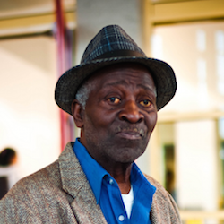

# Bernard

## Job/role description

Bernard is **a retired plumber** from Cincinnati, Ohio. He **believes
his grandfather was an employee** of the Rockefeller family, and would
like to find out more, although he does not know exactly what kind of
information might be available or how he might go about finding it. He
**has never visited an archive and is unfamiliar with archival
description, policies or procedure**.

Bernard **found the RAC by performing web searches**. He tried searching
our collections but was unable to find anything, so he **sent an inquiry
through the RAC website**.

Because he has health problems that prevent him from traveling, Bernard
**cannot visit the RAC in person,** but **would like copies of relevant
material sent to him**, preferably as photocopies, since he **has
difficulty viewing and managing digital files**.

## Hardware and software used

Bernard uses a five-year-old PC running Windows XP at home. He does not
have a smart phone and has no interest in tablets. The only browser
installed on his computer is Internet Explorer 8.

## Working locations and hours

Bernard works exclusively from home, and is likely to access the system
at any time of the day, although usually during business hours.
